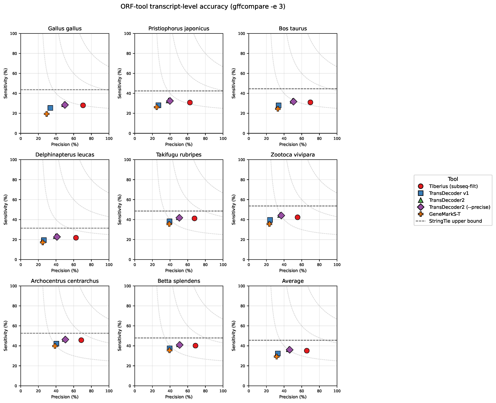
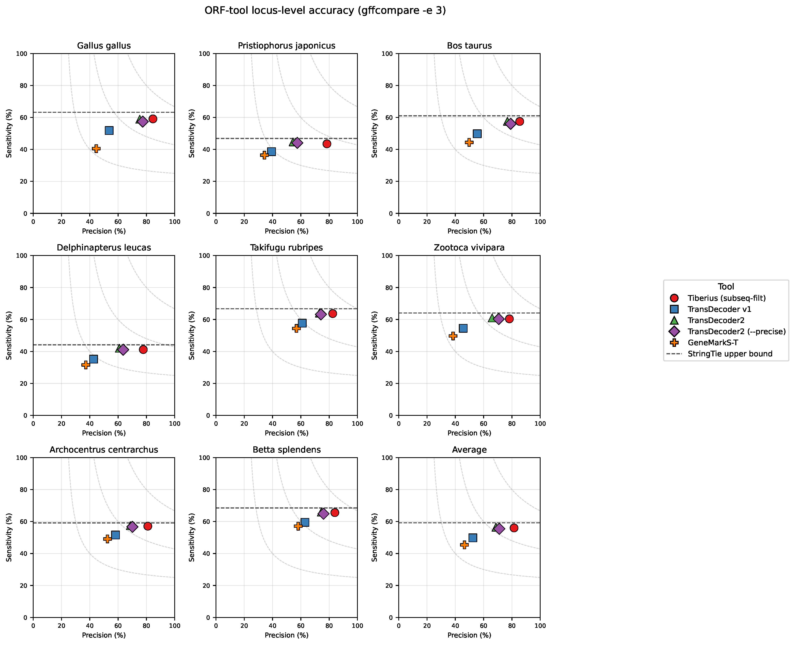
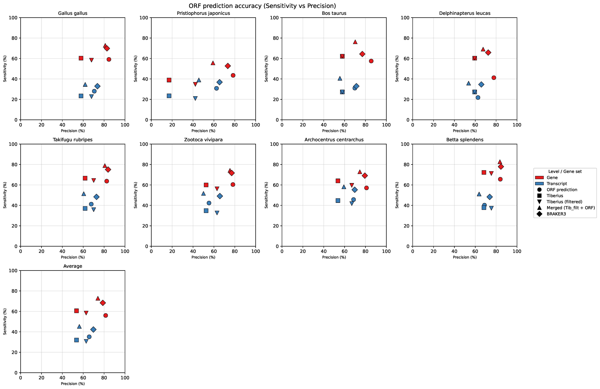

# tiberius_orf_finder — status, July 2026

Discussion doc for the group meeting. Covers the idea, current pipeline
state, and the accuracy benchmarks on the vertebrates_test split.

---

## 1. The idea

A transcript-driven ORF caller. Inputs are RNA-seq (or a StringTie GTF)
plus the corresponding genome; output is a genomic GTF of predicted CDS.

The goal is to complement ab-initio callers (Tiberius, BRAKER3), not to
replace them: the ORF finder is the only component in the pipeline that
actually listens to the assembled transcriptome, so the two signals are
largely independent and can be merged.

Architecture:

- CNN stem + BiLSTM (also a CNN + Transformer variant), per-position
  6-class classifier over `IR / START / E1 / E2 / E0 / STOP`.
- 6-state structured HMM (built on
  [bricks2marble](https://github.com/Gaius-Augustus/bricks2marble) +
  [hidten](https://github.com/Gaius-Augustus/hidten)) that enforces:
    - single canonical reading frame per ORF,
    - ATG at every START,
    - stop codon at every STOP,
    - in-frame stop check at E2 (no premature stops).
- Transcript → genome projection: predicted ORFs are lifted back through
  the StringTie exon structure with correct GTF phase per CDS segment.

---

## 2. What is in place

Data pipeline (Nextflow, on brain):

1. `FETCH_ASSEMBLY` — genome + reference annotation (RefSeq / BRAKER).
2. `MAKE_VARUS_PARAMS` + `RUN_VARUS` — RNA-seq download + HISAT2 alignment.
3. `RUN_STRINGTIE` + gffread — transcript assembly + spliced FASTA.
4. `LABEL_TRANSCRIPTS` — project reference CDS onto assembled transcripts.
5. `WRITE_TFRECORD` — chunk into 9,999-nt TFRecord windows.

Training & inference:

- Both `cnn_lstm` and `cnn_transformer` implemented; current headline
  model is `cnn_lstm` run006, epoch 74.
- Inference pipeline: batched NN forward pass + parallel HMM Viterbi
  (chunk-boundary repredictions handled) + genomic projection.
- Post-processing: subsequence-collapse step that drops predicted
  isoforms whose CDS is a strict sub-interval of a longer isoform in the
  same locus.

Evaluation:

- 8 held-out vertebrate species (`vertebrates_test`): Gallus gallus,
  Pristiophorus japonicus, Bos taurus, Delphinapterus leucas, Takifugu
  rubripes, Zootoca vivipara, Archocentrus centrarchus, Betta splendens.
- Reference: NCBI RefSeq CDS.
- Metric: `gffcompare --strict-match -e 3 -T`.

---

## 3. Vertebrates benchmark A — vs other transcript-based ORF tools

Same StringTie input (filter `TPM>=1, cov>=3, len>=300`), so this is
purely a comparison of the ORF-calling step. Numbers are the standard
`gffcompare` sensitivity (S) and precision (P) in %, means over the 8
species.

| Tool                     | Transcript S | Transcript P | Locus S | Locus P |
|--------------------------|:-:|:-:|:-:|:-:|
| **tiberius_orf_finder**  | **35.1** | **65.7** | **56.0** | **81.5** |
| TransDecoder2 (--precise) | 36.6 | 46.3 | 56.1 | 71.1 |
| TransDecoder2             | 36.6 | 45.3 | 56.4 | 68.7 |
| TransDecoder1             | 32.3 | 33.0 | 47.7 | 52.4 |
| GeneMarkS-T               | 29.2 | 31.6 | 45.4 | 45.2 |

Take-away: matching sensitivity, but ~+20 pp transcript-level precision
and ~+10 pp locus-level precision over the strongest baseline
(TransDecoder2 --precise). Per-species points and the StringTie upper
bound below.

Source table: [benchmark_orf_tools_filt_tpm1cov3len300/accuracy_table.tsv](../benchmarks/vertebrates_test_orf_tools_accuracy_table.tsv)
(on brain: `/projects/AI-GUSTUS/tiberius_orf_finder/results/vertebrates_test/benchmark_orf_tools_filt_tpm1cov3len300/accuracy_table.tsv`).

---

## 4. Vertebrates benchmark B — merged pipeline vs BRAKER3

Where the ORF finder actually earns its keep: adding it on top of the
Tiberius ab-initio calls closes the gap to BRAKER3, without using any
protein or evolutionary evidence.

Mean gene F1 over the same 8 species (source:
[eval_accuracy_epoch_74_filt_pfilt/accuracy_table.tsv](../benchmarks/vertebrates_test_pipeline_accuracy_table.tsv);
on brain:
`/projects/AI-GUSTUS/tiberius_orf_finder/results/vertebrates_test/eval_accuracy_epoch_74_filt_pfilt/accuracy_table.tsv`):

| Gene set                          | Mean gene F1 |
|-----------------------------------|:-:|
| Tiberius ab-initio only            | 56.4 |
| Tiberius ab-initio (subseq-filt)   | 60.4 |
| tiberius_orf_finder only           | 66.1 |
| **Tiberius + tiberius_orf_finder (merged)** | **73.4** |
| BRAKER3 (protein-informed)         | 73.1 |

Per-species detail (gene F1):

| Species | Tib | Tib-filt | ORF only | Merged | BRAKER3 |
|---|---:|---:|---:|---:|---:|
| Gallus gallus            | 59.1 | 62.8 | 69.6 | **76.7** | 75.8 |
| Pristiophorus japonicus  | 23.7 | 38.1 | 55.9 | 57.3 | **61.3** |
| Bos taurus               | 59.9 | 59.9 | 68.8 | **73.1** | 70.1 |
| Delphinapterus leucas    | 59.9 | 59.9 | 53.9 | 68.3 | **68.9** |
| Takifugu rubripes        | 64.1 | 67.1 | 71.9 | **79.8** | 79.2 |
| Zootoca vivipara         | 56.0 | 59.4 | 68.2 | **74.8** | 74.3 |
| Archocentrus centrarchus | 58.3 | 63.0 | 67.0 | 73.7 | **73.9** |
| Betta splendens          | 70.2 | 73.2 | 73.7 | **83.2** | 81.1 |

Sensitivity vs Precision per species and averaged (gene = red, transcript
= blue; shapes = tool):

Take-aways:

- Merged pipeline beats each component alone on **every** species.
- Merged is within ~1 pp of BRAKER3 on average and better on 5/8 species,
  despite BRAKER3 using cross-species protein evidence.
- The one species where we lose noticeably (Pristiophorus japonicus) has
  the weakest RNA-seq / assembly — that failure mode is upstream of the
  model.

---

## 5. Known weaknesses (from JBrowse2 review, see [eval_observations.md](eval_observations.md))

- **Start prediction at position 0 of the assembled transcript:** at
  `ref_ATG_pos == 0` the predicted-correct rate is **0 % in every
  species**. Cause is a mix of (a) no left context for the CNN receptive
  field, (b) codon emitter needing left-flanking bases, and (c)
  StringTie routinely dropping the first bases of the 5' UTR. Motivates
  the initial-state fix (O6, restrict HMM start to `{IR, START}`) and
  left-padding with Ns.
- **Sub-sequence isoforms:** ~28 % of predicted isoforms are strict
  sub-ORFs of a longer isoform in the same locus. The
  subsequence-collapse post-process (already applied in the numbers
  above) drops these.
- **StringTie gene splits:** 10-14 % of reference protein-coding genes
  are split across multiple StringTie loci. Real, but a smaller effect
  and it lives upstream of the model.

---

## 6. What is next

- **Fix the start-position-0 blind spot.** Implement O6
  (`state_start_dist` restricted to `{IR, START}`) and re-evaluate. Then
  test left-padding with Ns as a cheap complementary fix.
- **Longread branch.** `nextflow/main_longread.nf` + a longread training
  set are staged; first cnn_lstm longread run is in flight.
- **Broader clades.** Data prep for embryophyta, chlorophyta, fungi and
  diatoms is complete or in progress (see
  `training_{clade}_v2` on brain); we will report benchmarks per clade
  as the vertebrates one is now, once the models exist.
- **Merge policy on top of Tiberius:** the current merge is
  `merge_annotations.py --mode full`. Worth revisiting whether a
  softer, score-aware merge changes the balance vs BRAKER3.

---

## 7. Reproduction pointers

- Repo: [tiberius_orf_finder](https://github.com/) — main entry point
  is `scripts/annotate.py`.
- Pre-trained weights (on brain):
  `/home/gabriell/tiberius_orf_finder/results/models/`.
- Vertebrates benchmark job scripts:
  [scripts/slurm_eval_orf_tool_benchmarks_vertebrates_test_filt_tpm1cov3len300.sh](../scripts/slurm_eval_orf_tool_benchmarks_vertebrates_test_filt_tpm1cov3len300.sh),
  [scripts/slurm_annotate_vertebrates_test_filt_tpm1cov3len300_run006_epoch74.sh](../scripts/slurm_annotate_vertebrates_test_filt_tpm1cov3len300_run006_epoch74.sh).
- Raw tables (mirrored locally next to this doc):
    - [benchmarks/vertebrates_test_orf_tools_accuracy_table.tsv](../benchmarks/vertebrates_test_orf_tools_accuracy_table.tsv)
    - [benchmarks/vertebrates_test_pipeline_accuracy_table.tsv](../benchmarks/vertebrates_test_pipeline_accuracy_table.tsv)
